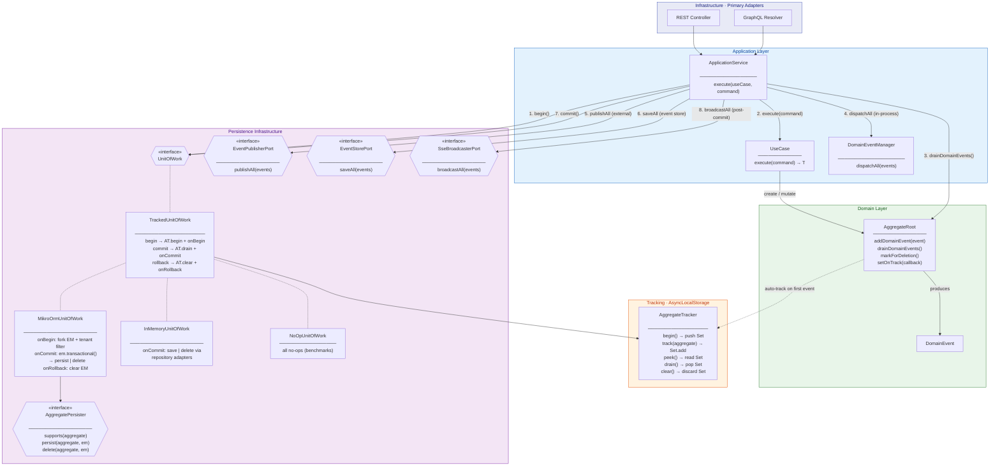

# Architecture

DDD with Hexagonal Architecture (Ports & Adapters). Dependencies point inward:
**infrastructure → application → domain**. Domain never imports from outer layers.

## End-to-end request flow

## Step-by-step

1. **Startup** — `AggregateRoot.setOnTrack(callback)` wires a global callback that calls `AggregateTracker.track(aggregate)` (done by `DatabaseFactory`).
2. **`begin()`** — `TrackedUnitOfWork` calls `AggregateTracker.begin()`, pushing a new `Set` onto a stack scoped to the current async context via `AsyncLocalStorage`. `MikroOrmUnitOfWork.onBegin()` additionally forks the EntityManager and applies the tenant filter when a tenant context is active.
3. **Use case** — When `aggregate.addDomainEvent(event)` is called, the aggregate auto-registers itself in the current scope (once per drain cycle). Aggregates can also call `markForDeletion()`.
4. **Drain & dispatch** — `ApplicationService` peeks at tracked aggregates, drains their domain events, dispatches in-process via `DomainEventManager`, publishes externally via `EventPublisherPort`, persists to the event store via `EventStorePort`.
5. **`commit()`** — `TrackedUnitOfWork` drains the scope and passes the aggregates to `onCommit()`. `MikroOrmUnitOfWork` wraps the work in `em.transactional()`, routing each aggregate to its `AggregatePersister` (calling `persist()` or `delete()` depending on `isMarkedForDeletion()`).
6. **`rollback()`** — `AggregateTracker.clear()` discards the current scope; the concrete UoW cleans up (e.g. `em.clear()`).
7. **Post-commit** — `ApplicationService` calls `sseBroadcaster.broadcastAll(events)` outside the try/catch (fire-and-forget).
8. **Nested scopes** — Stack-based design supports nested `begin()`/`commit()` within the same async context.

## Why this shape

- **Aggregates auto-track themselves** so use cases stay focused on domain logic — no manual return of aggregates, no `repository.save()` calls.
- **`AsyncLocalStorage`** isolates per-request state (tenant id, correlation id, EntityManager scope, tracked aggregates) without threading parameters through every layer.
- **`em.transactional()` on commit** ensures aggregate state, child entities, deletes, and event-store records are flushed atomically.
- **Event store inside the same transaction as aggregates** — events and aggregate writes commit together or roll back together (no dual-write divergence).
- **SSE broadcast _after_ commit** — external observers only see committed state.

See [ADRs](adrs/) for the long-form rationale of each decision.
